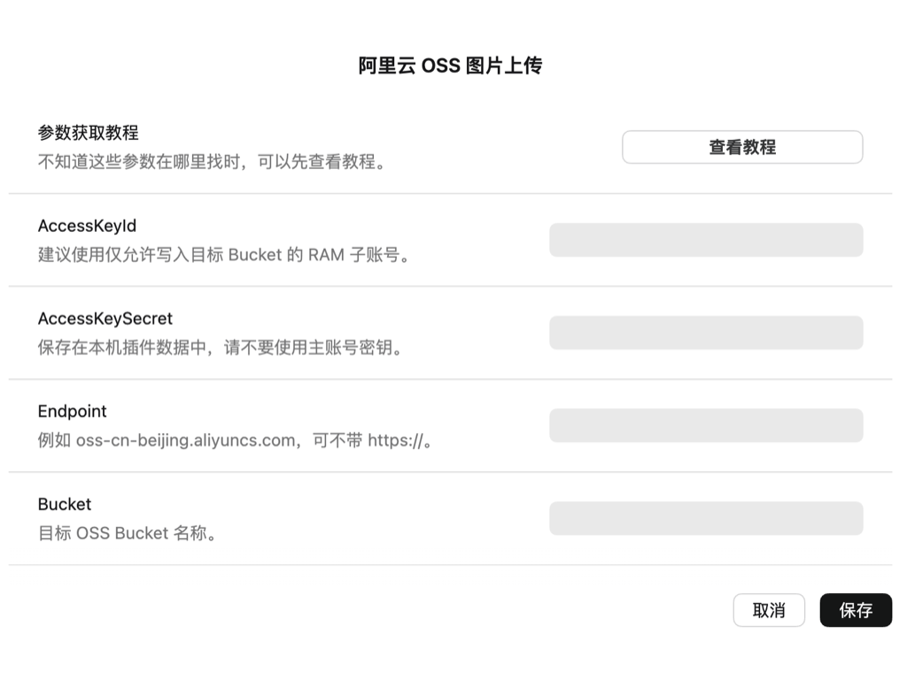

# 阿里云 OSS 图片上传

[English](README.md) | 简体中文

> 自动上传粘贴到思源笔记中的图片到阿里云 OSS，并在当前位置插入远程图片链接。



## 功能特性

- 粘贴截图或剪贴板图片时自动上传到阿里云 OSS
- 上传成功后自动插入 Markdown 图片链接
- 支持自定义 OSS 保存路径 `Path`
- 配置页内置参数获取教程入口
- 不改变普通文本粘贴；未完成配置时保留思源默认粘贴行为

## 使用方式

1. 安装并启用插件。
2. 打开插件设置，填写 `AccessKeyId`、`AccessKeySecret`、`Endpoint`、`Bucket` 和 `Path`。
3. 在 OSS Bucket 中配置 CORS，允许思源发起上传请求。
4. 在思源编辑器中粘贴截图或剪贴板图片。
5. 插件会上传图片，并插入类似下面的内容：

```markdown

```

## 配置说明

| 参数 | 说明 | 示例 |
| --- | --- | --- |
| `AccessKeyId` | 阿里云 AccessKey ID | `LTAI...` |
| `AccessKeySecret` | 阿里云 AccessKey Secret | `******` |
| `Endpoint` | OSS 外网访问 Endpoint，可不带协议 | `oss-cn-beijing.aliyuncs.com` |
| `Bucket` | 目标 Bucket 名称 | `my-image-bucket` |
| `Path` | 可选，图片保存路径前缀 | `img/` |

不知道这些参数在哪里获取时，可以参考：  
[折腾篇：用阿里云 OSS 搭建图床](https://blog.luluvip.cn/2021/11/09/%E6%8A%98%E8%85%BE%E7%AF%87%EF%BC%9A%E7%94%A8%E9%98%BF%E9%87%8C%E4%BA%91OSS%E6%90%AD%E5%BB%BA%E5%9B%BE%E5%BA%8A/)

## CORS 参考

在阿里云 OSS 控制台中，为目标 Bucket 添加跨域规则：

| 配置项 | 建议值 |
| --- | --- |
| 来源 | 测试时可填 `*`，正式使用建议收紧 |
| Method | `PUT` |
| Header | `*` |
| Expose Header | `ETag` |

如果粘贴图片时提示上传失败，优先检查 CORS、AccessKey 权限、Bucket 和 Endpoint 是否正确。

## 安全建议

插件运行在本地前端环境，AccessKey 会保存在本机插件数据中。建议创建 RAM 子账号，并只授予目标 Bucket 指定路径的写入权限，不要使用阿里云主账号 AccessKey。

如果你曾经把 AccessKey 提交到公开仓库，请立即在阿里云控制台禁用或轮换旧密钥。

## 开发

```bash
npm install
npm run dev
```

生产构建：

```bash
npm run build
```

构建后会生成 `package.zip`，可用于 GitHub Release 和思源集市上架。

## 许可证

MIT
